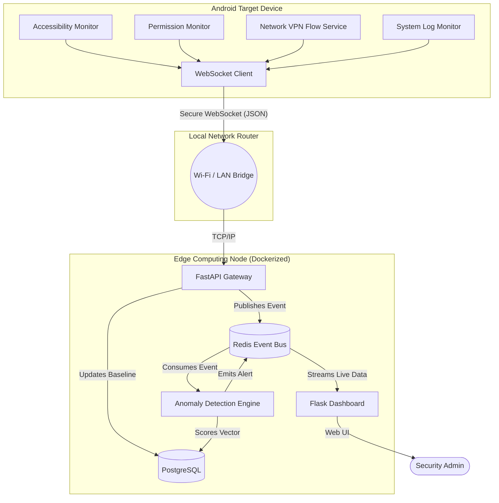
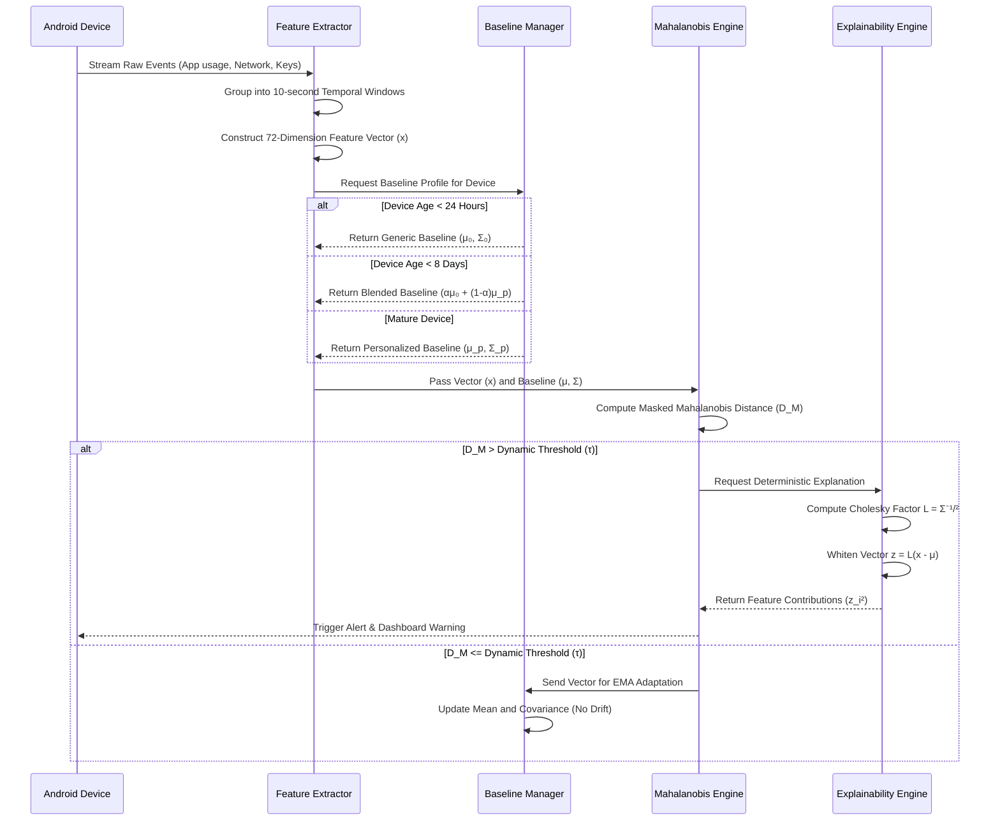
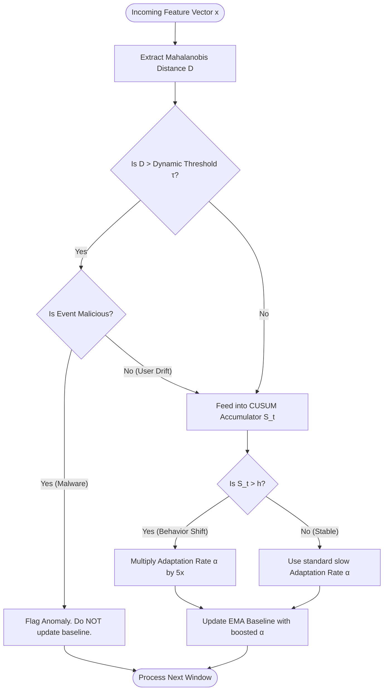

# Architecture and System Diagrams
**Behavioral Log Anomaly Detection Using Machine Learning**

This document provides high-level architectural, network, data, and flow diagrams for the Edge-Based AI Log Detector.

---

## 1. High-Level Architecture Diagram
This diagram outlines the physical deployment and separation of concerns between the Android Client, Edge Server, and the Dashboard.

*(Note: The above diagram uses conceptual routing. The actual architecture involves the Android Device sending WebSocket packets over the local network router to the Edge Server. No external cloud provider is used for telemetry processing).*

---

## 2. System and Network Topology
This illustrates the Localized Edge Air-Gap Architecture. All heavy AI processing is localized to the Edge node, protecting user privacy.

---

## 3. Data Flow Diagram (The ML Pipeline)
This diagram maps how raw telemetry is aggregated into a mathematical matrix and processed for anomalies.

---

## 4. Concept Drift vs. Anomaly Detection Flow
This flowchart demonstrates the logic inside the `SelfTuningCUSUM` module, which handles the "Concept Drift vs. Anomaly" challenge.

